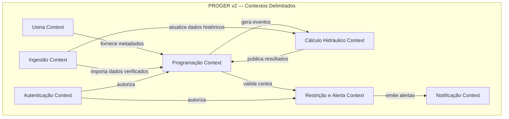
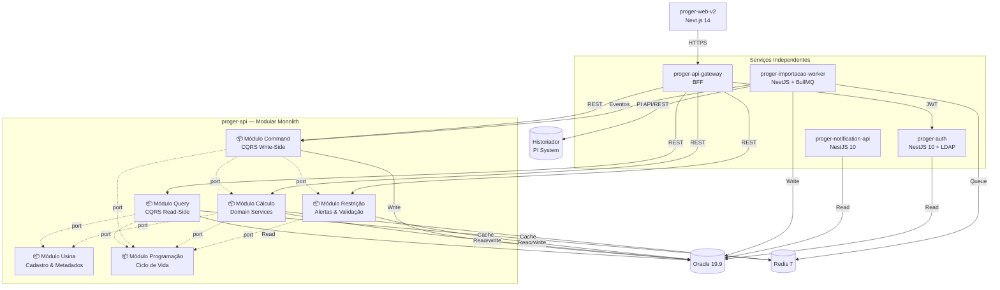
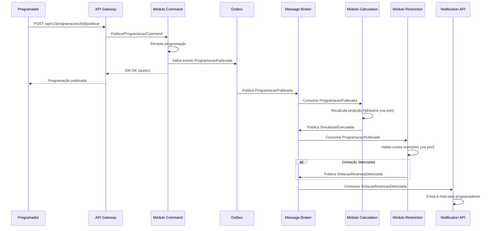

# ARQUITETURA-PROGER-v2.md

> **Documento de Arquitetura de Software — PROGER v2.0**
> **Status:** Draft | **Data:** 2026-06-24
> **Owner:** Supero Smart Code / Engie
> **Versão:** 2.0-Draft — Modular Monolith

---

## 1. Resumo Executivo

O PROGER (Programação de Geração) é a plataforma crítica da ENGIE para simulação e programação operativa de usinas hidroelétricas e termoelétricas. A arquitetura atual, construída entre 2019–2023, apresenta acoplamento excessivo no monolito Java (`proger-api`), duplicação de regras de negócio entre frontend e backend, e ausência de separação de responsabilidades entre serviço de consulta e ingestão de dados.

Este documento define a **arquitetura-alvo** para uma PoC (com caminho para aplicação completa) baseada em:

- **DDD estratégico e tático** (Linguagem Ubíqua, Contextos Delimitados, Ports & Adapters)
- **CQRS** para separação de leitura e escrita
- **Microserviços especializados** (separação da ingestão do serviço de consulta)
- **Migração dos cálculos hidráulicos** do frontend para o backend como Domain Services
- **Stack moderna:** NestJS 10 (Node 20 LTS), Next.js 14 (React 18), Oracle 19.9, Redis, BullMQ

---

## 2. Análise da Arquitetura Atual

### 2.1 Stack Legacy

| Serviço | Stack | Porta | Problema |
| --------- | ------- | ------- | ---------- |
| `proger-api` | Java 11, Spring Boot 2.6.6, JPA | 8080 | Monolito com dupla responsabilidade: consulta + importação |
| `proger-auth` | NestJS 8, Node 14 | 3001 | Versão antiga do NestJS/Node |
| `proger-utils-api` | NestJS 7, Node | 3001 | **Conflito de porta** com `proger-auth` |
| `proger-notification-api` | NestJS 10, Node 21 | 3002 | Node 21 com CVE crítica (PRG-462) |
| `proger-web` | React 16, Redux, Material-UI 4, CRA | 3000 | Frontend legado; cálculos hidráulicos no browser |

### 2.2 Problemas Críticos Identificados

#### Problema 1: Dual Responsabilidade no `proger-api`

O monolito Java acumula duas responsabilidades distintas:

- **Servir dados ao frontend:** queries REST para usinas, programações, dados históricos, restrições
- **Importação/consume de dados:** jobs automáticos (`ScheduledTasks.java`) que consomem dados do ONS e do Historiador a cada 5–30 minutos

> **Nota:** Existiu um estudo (`proger-historiador-api`, Java 21/Spring Boot 3.4.2) que visava separar essa responsabilidade de importação, mas **nunca entrou em produção**. Na nova arquitetura, essa separação será realizada pelo `proger-importacao-worker`.

**Impacto:** dificuldade de escalar independentemente, acoplamento temporal entre ingestão e consulta, deploys arriscados.

#### Problema 2: Regras de Cálculo no Frontend

O arquivo `DadosGraficoUtils.js` (React) implementa toda a lógica de cálculo hidráulico:

- `calculaVazaoAfluente`
- `calculaVazaoDefluenteMontante`
- `calculaVazaoTurbinada`
- `calculoVolumeTotal`
- `calculaNivelReservatorio`
- `previsaoDeVaoLivre`

Isso duplica a lógica existente em `CalculosUsinas.java` (backend) e impede:

- Testes automatizados robustos nos cálculos
- Reutilização por outros consumidores (APIs, relatórios, jobs)
- Consistência de regras entre frontend e backend

#### Problema 3: CORS Aberto e Segurança

Wildcard CORS em todos os serviços (`@CrossOrigin(origins = "*")`).

#### Problema 4: Frontend Legado

React 16 + Redux + Material-UI 4 + CRA. Sem SSR, sem code-splitting moderno, sem TypeScript.

### 2.3 Anti-Patterns Detectados

| Anti-Pattern | Evidência | Severidade |
| -------------- | ----------- | ------------ |
| God Class / God Service | `proger-api` acumula consulta, importação, cálculo, agendamento | Alta |
| Anemic Domain Model | Entidades JPA (`@Data` Lombok) com comportamento em Services procedural | Média |
| Duplicate Business Logic | `DadosGraficoUtils.js` vs `CalculosUsinas.java` | Alta |
| Database-as-Integration | Jobs acessam diretamente tabelas Oracle sem contrato de eventos | Média |
| Magic Numbers | `INDEX_FIXOS.ULTIMO_INDEX_INTERVALO_TEMPO_DIA_ANTERIOR = 46` | Média |
| Primitive Obsession | `String cdUsina`, `Double vlVolume` sem Value Objects | Média |

---

## 3. Modelagem Estratégica DDD

### 3.1 Linguagem Ubíqua (Glossário PROGER)

| Termo | Significado | Contexto |
| ------- | ------------- | ---------- |
| **Usina** | Unidade geradora (hidroelétrica ou termoelétrica) | Todos |
| **Programação** | Planejamento horário de geração para uma usina em um dia | Programação |
| **Dados de Programação** | Registros horários (MW, vazão, nível) de uma programação | Programação |
| **Dados Verificados** | Dados do historiador já conciliados e validados | Ingestão |
| **Vazão Afluente** | Soma da vazão incremental + média das defluentes dos montantes | Cálculo Hidráulico |
| **Vazão Defluente** | Vazão turbinada + vazão vertida + vazão de vão livre | Cálculo Hidráulico |
| **Vazão Turbinada** | Geração (MW) / Produtibilidade | Cálculo Hidráulico |
| **Volume Total** | Volume anterior + variação (vazão afluente - defluente) / coef. conv. | Cálculo Hidráulico |
| **Nível de Reservatório** | Interpolação linear da curva cota-volume | Cálculo Hidráulico |
| **Previsão de Vão Livre** | Estimativa de vazão de vão livre com base no nível anterior | Cálculo Hidráulico |
| **Restrição** | Limite operacional (máximo, mínimo, condicional) aplicado a uma usina | Restrições |
| **Alerta de Violação** | Notificação gerada quando dados da programação infringem uma restrição | Restrições |
| **Publicação** | Ato de tornar a programação oficial para o ONS | Programação |
| **Importação Manual** | Carga de dados via planilha CSV/Excel pelo programador | Ingestão |
| **Importação Automática** | Job periódico (5 min / 30 min) consumindo ONS e Historiador | Ingestão |
| **Job SOA** | Tarefa de importação executada com controle de timeout e retry | Ingestão |
| **Curva Cota-Volume** | Tabela de correlação entre cota operativa e volume do reservatório | Cálculo Hidráulico |
| **Produtibilidade** | Fator de conversão MW -> vazão (m³/s) por usina | Cálculo Hidráulico |

### 3.2 Contextos Delimitados (Bounded Contexts)



#### BC-01: Usina Context

- **Responsabilidade:** Cadastro e metadados de usinas (hidro/termo), relações de montante/jusante, curvas cota-volume, produtibilidade, parâmetros operacionais
- **Entidades:** `Usina`, `RelacUsinas`, `CurvaCotaVol`, `Parametros`, `PotenciaQdBruta`
- **API Pública:** CRUD de usinas; consulta de parâmetros; curvas cota-volume por usina

#### BC-02: Programação Context

- **Responsabilidade:** Ciclo de vida da programação diária: criação, edição, publicação, consulta histórica
- **Entidades:** `Programacao`, `DadosProgramacao`, `DadosProgTerm`
- **API Pública:** CRUD de programação; publicação; consulta por data e usina

#### BC-03: Ingestão Context

- **Responsabilidade:** Importação automática (ONS/Historiador) e manual (CSV/Excel); orquestração de jobs SOA; rastreamento de execução
- **Entidades:** `Historiador`, `DadosHistoriador`, `ImportarManual`, `JobSoa`, `DetalheJobSoa`, `Arquivo`
- **API Pública:** endpoint de upload manual; toggle de jobs automáticos; status de execução

#### BC-04: Cálculo Hidráulico Context

- **Responsabilidade:** Cálculos hidráulicos, simulações de cenário, projeção de níveis e vazões
- **Entidades:** Nenhuma (Domain Services puros), mas mantém `Vazao`, `Volume`, `Nivel` como Value Objects
- **API Pública:** `simularProgramacao`, `calcularBalançoHidrico`, `preverNivelReservatorio`

#### BC-05: Restrição e Alerta Context

- **Responsabilidade:** Cadastro de restrições operacionais, validação de programação contra restrições, emissão de alertas de violação
- **Entidades:** `RestricaoUsina`, `CondicionalRestricao`, `AlertaRestricao`
- **API Pública:** CRUD de restrições; validar programação; listar alertas

#### BC-06: Notificação Context

- **Responsabilidade:** Envio de e-mails/SMS/relatórios; templates; destinatários
- **Entidades:** `Destinatario`, `TemplateNotificacao`, `Envio`
- **API Pública:** disparar notificação; agendar relatório

#### BC-07: Autenticação Context

- **Responsabilidade:** Autenticação LDAP/AD, geração de JWT, perfis de acesso, autorização RBAC
- **Entidades:** `Usuario`, `Perfil`, `Permissao`
- **API Pública:** login, refresh token, validar permissão

### 3.3 Mapa de Contextos

| Relação | Tipo | Justificativa |
| --------- | ------ | --------------- |
| Programação → Usina | **Customer-Supplier** | Programação consome metadados de usinas; Usina Context é upstream |
| Programação → Cálculo Hidráulico | **Customer-Supplier** | Programação solicita simulações; Cálculo é upstream especializado |
| Ingestão → Programação | **Customer-Supplier** | Ingestão alimenta programações com dados verificados |
| Restrição → Programação | **Customer-Supplier** | Restrição valida programações publicadas |
| Notificação → Restrição | **Conformist** | Notificação consome eventos de violação sem exigir mudanças no upstream |
| Programação → Notificação | **Published Language** | Eventos de publicação consumidos assincronamente |
| Auth → Todos | **Shared Kernel** (parcial) | Usuário/perfil compartilhado via JWT claims; não há replicação de dados |

---

## 4. Modelagem Tática DDD

### 4.1 Value Objects

```typescript
// domain/value-objects/codigo-usina.vo.ts
export class CodigoUsina {
  private constructor(private readonly value: string) {}

  static create(value: string): CodigoUsina {
    if (!/^[A-Z]{2,4}$/.test(value)) {
      throw new DomainException('Código de usina inválido. Esperado: 2–4 letras maiúsculas.');
    }
    return new CodigoUsina(value);
  }

  toString(): string { return this.value; }
}

// domain/value-objects/vazao.vo.ts
export class Vazao {
  private constructor(readonly valor: number, readonly unidade: 'm3/s') {}

  static create(valor: number): Vazao {
    if (valor < 0) throw new DomainException('Vazão não pode ser negativa.');
    return new Vazao(valor, 'm3/s');
  }

  add(other: Vazao): Vazao {
    return Vazao.create(this.valor + other.valor);
  }

  toTurbinada(geracaoMW: number, produtibilidade: number): Vazao {
    if (produtibilidade === 0) throw new DomainException('Produtibilidade não pode ser zero.');
    return Vazao.create(Math.round(geracaoMW / produtibilidade));
  }
}

// domain/value-objects/volume.vo.ts
export class Volume {
  private constructor(readonly valorHm3: number) {}

  static create(valorHm3: number): Volume {
    return new Volume(valorHm3);
  }

  calcularVariacao(vazaoAfluente: Vazao, vazaoDefluente: Vazao, coefConversao: number): Volume {
    const variacao = (vazaoAfluente.valor - vazaoDefluente.valor) / coefConversao;
    return Volume.create(this.valorHm3 + variacao);
  }
}

// domain/value-objects/nivel-reservatorio.vo.ts
export class NivelReservatorio {
  private constructor(readonly valor: number, readonly unidade: 'm') {}

  static create(valor: number): NivelReservatorio {
    return new NivelReservatorio(valor, 'm');
  }

  static interpolar(
    volumeTotal: Volume,
    curva: Array<{ cota: number; volume: number }>
  ): NivelReservatorio {
    // lógica de interpolação linear
    // ...
    return NivelReservatorio.create(nivelInterpolado);
  }
}

// domain/value-objects/periodo-programacao.vo.ts
export class PeriodoProgramacao {
  private constructor(
    readonly data: LocalDate,
    readonly intervalo: IntervaloTempo
  ) {}

  static create(dataStr: string, horaMin: string): PeriodoProgramacao {
    return new PeriodoProgramacao(LocalDate.parse(dataStr), IntervaloTempo.create(horaMin));
  }
}
```

### 4.2 Entities

```typescript
// domain/entities/usina.entity.ts
export class Usina extends AggregateRoot {
  private constructor(
    public readonly cdUsina: CodigoUsina,
    public nmUsina: string,
    public tipo: TipoUsina,
    public readonly flUsinaEngie: boolean,
    public cdSigla: string,
    public cdGrpUsina: string,
    public readonly nrOrdUsina: number,
    public curvaCotaVolume: CurvaCotaVol[]
  ) {
    super();
  }

  static create(dto: CriarUsinaDTO): Usina {
    // validações de invariantes
    return new Usina(/* ... */);
  }

  isHidro(): boolean { return this.tipo === TipoUsina.HIDRO; }
  isTermo(): boolean { return this.tipo === TipoUsina.TERMO; }
}

// domain/entities/programacao.entity.ts
export class Programacao extends AggregateRoot {
  private constructor(
    public readonly cdProgramacao: number,
    public readonly usina: Usina,
    public dtProgramacao: LocalDate,
    public situacao: SituacaoProgramacao,
    public dados: DadosProgramacao[],
    public readonly dadosTermo?: DadosProgTerm[]
  ) {
    super();
  }

  publicar(usuario: Usuario): void {
    if (this.situacao !== SituacaoProgramacao.EM_EDICAO) {
      throw new DomainException('Somente programação em edição pode ser publicada.');
    }
    this.situacao = SituacaoProgramacao.PUBLICADA;
    this.addDomainEvent(new ProgramacaoPublicada(this.cdProgramacao, usuario.id, LocalDateTime.now()));
  }

  adicionarDados(dados: DadosProgramacao): void {
    // invariantes de negócio
    this.dados.push(dados);
  }
}

// domain/entities/dados-programacao.entity.ts
export class DadosProgramacao {
  constructor(
    public readonly cdDadosProg: number,
    public readonly periodo: PeriodoProgramacao,
    public geracaoMW: number,
    public vazaoVertida: Vazao,
    public vazaoIncremental: Vazao,
    public nivelReservatorio: NivelReservatorio,
    public volumeTotal: Volume,
    public vazaoTurbinada: Vazao,
    public vazaoDefluente: Vazao,
    public vazaoAfluente: Vazao,
    public dadosVerificados: boolean,
    public readonly flags: FlagsVerificacao
  ) {}
}

// domain/entities/restricao-usina.entity.ts
export class RestricaoUsina extends AggregateRoot {
  constructor(
    public readonly cdRestricao: number,
    public readonly usina: Usina,
    public descricao: string,
    public periodo: PeriodoProgramacao,
    public vigenciaInicio: LocalDateTime,
    public vigenciaFim: LocalDateTime,
    public maximo: number | null,
    public minimo: number | null,
    public tipoVigencia: TipoVigenciaRestricao,
    public condicoes: CondicionalRestricao[]
  ) {
    super();
  }

  validarContra(dados: DadosProgramacao): ViolacaoRestricao | null {
    // lógica de validação
    if (this.estaEmVigencia(dados.periodo)) {
      // verificar condicionais
      // retornar violação se houver
    }
    return null;
  }
}
```

### 4.3 Domain Services

```typescript
// domain/services/calculo-hidraulico.service.ts
export interface ICalculoHidraulicoService {
  calcularVazaoDefluente(geracaoMW: number, vazaoVertida: Vazao, produtibilidade: number): Vazao;
  calcularVazaoAfluente(vazaoIncremental: Vazao, montantes: RelacUsinas[], dadosContexto: DadosContexto): Vazao;
  calcularVolumeTotal(volumeAnterior: Volume, afluente: Vazao, defluente: Vazao, coefConvMin: number): Volume;
  calcularNivelReservatorio(volume: Volume, curva: CurvaCotaVol[]): NivelReservatorio;
  preverVaoLivre(tabelaVazaoVaoLivre: TabelaVaoLivre, nivelAnterior: NivelReservatorio): Vazao;
  simularProgramacao(cenario: CenarioSimulacao): ResultadoSimulacao;
}

// domain/services/alerta-violacao.service.ts
export interface IAlertaViolacaoService {
  validarProgramacaoContraRestricoes(programacao: Programacao): AlertaRestricao[];
  processarAlertas(alertas: AlertaRestricao[]): void;
}

// domain/services/importacao-historiador.service.ts
export interface IImportacaoHistoriadorService {
  importarDadosVerificados(usina: Usina, data: LocalDate): Promise<DadosHistoriador[]>;
  conciliarDadosHistoriador(historiador: Historiador): Promise<ConciliacaoResult>;
}
```

### 4.4 Domain Events

```typescript
// domain/events/programacao-publicada.event.ts
export class ProgramacaoPublicada implements DomainEvent {
  readonly eventType = 'ProgramacaoPublicada';
  readonly occurredOn: Date;

  constructor(
    public readonly cdProgramacao: number,
    public readonly publicadoPor: string,
    public readonly dtPublicacao: LocalDateTime
  ) {
    this.occurredOn = new Date();
  }
}

// domain/events/dados-historiador-importados.event.ts
export class DadosHistoriadorImportados implements DomainEvent {
  readonly eventType = 'DadosHistoriadorImportados';
  readonly occurredOn: Date;

  constructor(
    public readonly cdUsina: string,
    public readonly dtProgramacao: LocalDate,
    public readonly registrosImportados: number,
    public readonly jobId: number
  ) {
    this.occurredOn = new Date();
  }
}

// domain/events/violacao-restricao-detectada.event.ts
export class ViolacaoRestricaoDetectada implements DomainEvent {
  readonly eventType = 'ViolacaoRestricaoDetectada';
  readonly occurredOn: Date;

  constructor(
    public readonly cdRestricao: number,
    public readonly cdProgramacao: number,
    public readonly cdUsina: string,
    public readonly descricaoViolacao: string,
    public readonly severidade: 'CRITICA' | 'AVISO'
  ) {
    this.occurredOn = new Date();
  }
}

// domain/events/simulacao-executada.event.ts
export class SimulacaoExecutada implements DomainEvent {
  readonly eventType = 'SimulacaoExecutada';
  readonly occurredOn: Date;

  constructor(
    public readonly simulacaoId: string,
    public readonly cdUsina: string,
    public readonly dtProgramacao: LocalDate,
    public readonly resultadoHash: string // hash do cenário para cache
  ) {
    this.occurredOn = new Date();
  }
}
```

---

## 5. Arquitetura Técnica

### 5.1 Padrão Ports & Adapters (Hexagonal)

Cada microserviço segue a estrutura hexagonal:

```
┌────────────────────────────────────────────────────────┐
│  Frameworks & Drivers                                    │
│  ┌──────────────────────────────────────────────────┐ │
│  │  Interface Adapters                               │ │
│  │  ┌────────────────────────────────────────────┐   │ │
│  │  │  Application (Use Cases / CQRS Handlers) │   │ │
│  │  │  ┌──────────────────────────────────────┐ │   │ │
│  │  │  │  Domain (Entities, VOs, Services)  │ │   │ │
│  │  │  └──────────────────────────────────────┘ │   │ │
│  │  └────────────────────────────────────────────┘   │ │
│  └──────────────────────────────────────────────────┘ │
└────────────────────────────────────────────────────────┘
```

**Regras:**

- Domain não importa Application, Adapters ou Frameworks
- Application não importa Adapters ou Frameworks
- Adapters importam Application e Domain
- Frameworks (NestJS decorators, ORM, HTTP) ficam apenas nos Adapters

### 5.2 CQRS (Command Query Responsibility Segregation)

Aplicado nos contextos:

- **Programação Context:** separação entre `CommandBus` (publicar, editar, importar) e `QueryBus` (listar, filtrar, agregar)
- **Ingestão Context:** comandos de importação (assíncronos) vs queries de status
- **Cálculo Hidráulico Context:** comandos de simulação (assíncronos) vs queries de resultado

**Implementação:**

```typescript
// application/commands/publicar-programacao.command.ts
export class PublicarProgramacaoCommand {
  constructor(
    public readonly cdProgramacao: number,
    public readonly usuarioId: string
  ) {}
}

// application/queries/buscar-programacao.query.ts
export class BuscarProgramacaoQuery {
  constructor(
    public readonly cdUsina: string,
    public readonly dtProgramacao: string
  ) {}
}
```

### 5.3 Event-Driven & Outbox Pattern

Para garantir consistência eventual sem transações distribuídas:

- **Outbox Pattern:** eventos de domínio são salvos na mesma transação do banco (tabela `outbox`) e posteriormente publicados no message broker
- **Consumer Idempotency:** handlers de eventos devem ser idempotentes (chave de idempotência por `eventId`)
- **Dead Letter Queue:** eventos que falham após retry são direcionados para DLQ com métricas

### 5.4 SAGA (Orquestração)

Para processos transacionais complexos:

- **Saga de Publicação de Programação:**
  1. Comando: PublicarProgramação
  2. Evento: ProgramacaoPublicada
  3. Step: Validar contra Restrições (Restrição Context)
  4. Step: Calcular Projeção Hidráulica (Cálculo Context)
  5. Step: Notificar Destinatários (Notificação Context)
  6. Compensação: Reverter publicação se notificação falhar (configurável)

---

## 6. Definição dos Serviços e Módulos

### 6.1 Princípio: Modular Monolith com Ports & Adapters

A arquitetura adota um **modular monolith** como estratégia inicial: serviços com responsabilidades próximas coexistem no mesmo projeto, separados em **módulos NestJS independentes** que se comunicam exclusivamente via **ports (interfaces)**. Cada módulo mantém seu próprio domínio, casos de uso e infraestrutura, respeitando o padrão Hexagonal.

> **Vantagem:** Se um módulo crescer a ponto de justificar um serviço independente, a migração é trivial — basta extrair o módulo para um projeto separado, implementar um adapter de transporte (REST/gRPC) no lugar da chamada in-process, e manter as mesmas interfaces de port.

> **Regra de ouro:** Módulos NUNCA importam implementações de outros módulos diretamente. Toda comunicação passa por interfaces (ports) definidas no módulo consumidor.



### 6.2 Estrutura do Projeto `proger-api` (Modular Monolith)

```
proger-api/
├── src/
│   ├── main.ts
│   ├── app.module.ts                    # Módulo raiz (registra todos os módulos)
│   │
│   ├── modules/
│   │   ├── query/                        # 📦 Módulo Query (CQRS Read-Side)
│   │   │   ├── application/
│   │   │   │   ├── queries/               # Query handlers
│   │   │   │   └── dtos/                 # Response DTOs
│   │   │   ├── domain/
│   │   │   │   └── read-models/          # Denormalized read models
│   │   │   ├── infrastructure/
│   │   │   │   ├── controllers/           # REST controllers
│   │   │   │   ├── repositories/         # Oracle read repos
│   │   │   │   └── cache/               # Redis cache adapters
│   │   │   └── query.module.ts
│   │   │
│   │   ├── command/                      # 📦 Módulo Command (CQRS Write-Side)
│   │   │   ├── application/
│   │   │   │   ├── commands/              # Command handlers
│   │   │   │   ├── events/               # Domain event handlers
│   │   │   │   ├── sagas/                # Saga orchestration
│   │   │   │   └── dtos/                 # Request DTOs
│   │   │   ├── domain/
│   │   │   │   ├── entities/             # Aggregate roots, entities
│   │   │   │   ├── value-objects/        # VOs (Vazao, Volume, etc.)
│   │   │   │   ├── events/               # Domain events
│   │   │   │   └── ports/               # Interfaces (outbound contracts)
│   │   │   ├── infrastructure/
│   │   │   │   ├── controllers/           # REST controllers
│   │   │   │   ├── repositories/          # Oracle write repos
│   │   │   │   ├── outbox/               # Outbox pattern adapter
│   │   │   │   └── messaging/            # Event publisher adapters
│   │   │   └── command.module.ts
│   │   │
│   │   ├── calculation/                 # 📦 Módulo Cálculo Hidráulico
│   │   │   ├── application/
│   │   │   │   ├── use-cases/            # Simulação, balanço hidráulico
│   │   │   │   └── dtos/
│   │   │   ├── domain/
│   │   │   │   ├── services/             # CalculoHidraulicoService, etc.
│   │   │   │   ├── value-objects/        # Vazao, Volume, NivelReservatorio
│   │   │   │   └── ports/                # IUsinaRepository, ICurvaCotaVolRepository
│   │   │   ├── infrastructure/
│   │   │   │   ├── controllers/           # REST + job triggers
│   │   │   │   ├── jobs/                # BullMQ job handlers
│   │   │   │   ├── repositories/          # Adapters para Oracle
│   │   │   │   └── cache/               # Redis cache adapters
│   │   │   └── calculation.module.ts
│   │   │
│   │   ├── restriction/                  # 📦 Módulo Restrição & Alertas
│   │   │   ├── application/
│   │   │   │   ├── use-cases/            # Validar programação, emitir alerta
│   │   │   │   ├── event-handlers/        # Reage a ProgramacaoPublicada
│   │   │   │   └── dtos/
│   │   │   ├── domain/
│   │   │   │   ├── entities/             # RestricaoUsina, CondicionalRestricao
│   │   │   │   ├── value-objects/        # PeriodoVigencia, TipoRestricao
│   │   │   │   ├── services/             # AlertaViolacaoService
│   │   │   │   └── ports/                # IProgramacaoPort, INotificationPort
│   │   │   ├── infrastructure/
│   │   │   │   ├── controllers/
│   │   │   │   ├── repositories/
│   │   │   │   └── messaging/            # Event consumer adapters
│   │   │   └── restriction.module.ts
│   │   │
│   │   ├── usina/                        # 📦 Módulo Usina
│   │   │   ├── application/
│   │   │   ├── domain/
│   │   │   │   ├── entities/             # Usina, RelacUsinas
│   │   │   │   ├── value-objects/        # CodigoUsina, TipoUsina
│   │   │   │   └── ports/
│   │   │   ├── infrastructure/
│   │   │   └── usina.module.ts
│   │   │
│   │   └── programacao/                  # 📦 Módulo Programação
│   │       ├── application/
│   │       ├── domain/
│   │       │   ├── entities/             # Programacao, DadosProgramacao
│   │       │   ├── value-objects/        # PeriodoProgramacao, SituacaoProgramacao
│   │       │   ├── events/               # ProgramacaoPublicada, etc.
│   │       │   └── ports/
│   │       ├── infrastructure/
│   │       └── programacao.module.ts
│   │
│   └── shared/                            # Shared Kernel (mínimo)
│       ├── domain/                        # DomainException, AggregateRoot
│       ├── application/                   # Command, Query, Event base classes
│       └── infrastructure/                # CommonModule, logging, health
│
├── test/
├── nest-cli.json
├── tsconfig.json
└── package.json
```

### 6.3 Regras de Comunicação entre Módulos

| Regra | Descrição |
| ------- | ---------- |
| **Ports, não imports diretos** | Módulo A nunca importa uma classe concreta do Módulo B. Toda dependência é via interface (port) definida no módulo consumidor |
| **Adapters in-process** | Na configuração modular monolith, o adapter de infraestrutura é uma chamada in-process que implementa a port. Ao extrair para microserviço, troca-se o adapter in-process por um adapter REST/gRPC |
| **Domain Events internos** | Eventos de domínio são publicados via `EventEmitter2` do NestJS dentro do mesmo processo. Ao extrair, troca-se por pub/sub em Redis (BullMQ) |
| **Banco compartilhado, schemas separados** | Todos os módulos acessam o mesmo Oracle, mas cada um só lê/escreve nas tabelas do seu bounded context. O módulo Query pode ler de qualquer tabela (read-side) |
| **Migração futura = trocar adapter** | Exemplo: `IProgramacaoPort` no módulo Calculation hoje é implementado por `ProgramacaoInProcessAdapter`. Ao separar Calculation em microserviço, troca-se por `ProgramacaoHttpAdapter` que chama a API REST |

### 6.4 Detalhamento dos Módulos Internos

#### 6.4.1 Módulo Query (CQRS Read-Side)

- **Tipo:** Módulo interno do `proger-api`
- **Responsabilidade:** Leitura otimizada para o frontend; read model denormalizado; queries complexas com paginação e cache
- **Tecnologia:** NestJS 10, TypeORM (Oracle), Redis para cache de queries frequentes
- **Endpoints principais:**
  - `GET /api/v2/programacoes?cdUsina=&dtProgramacao=&page=&size=`
  - `GET /api/v2/programacoes/{id}/dados`
  - `GET /api/v2/usinas/{cdUsina}/historico?dtInicio=&dtFim=`
  - `GET /api/v2/dashboard/{cdUsina}/{dtProgramacao}` (aggregated view)

#### 6.4.2 Módulo Command (CQRS Write-Side)

- **Tipo:** Módulo interno do `proger-api`
- **Responsabilidade:** Comandos de negócio: criar/editar programação, publicar, importar manual, aprovar
- **Tecnologia:** NestJS 10, CQRS com `@nestjs/cqrs`, Outbox Pattern
- **Commands:**
  - `CriarProgramacaoCommand`
  - `EditarDadosProgramacaoCommand`
  - `PublicarProgramacaoCommand`
  - `ImportarManualCommand`
  - `ExecutarSimulacaoCommand` (delega para Calculation via port)

#### 6.4.3 Módulo Calculation (Cálculo Hidráulico)

- **Tipo:** Módulo interno do `proger-api` (candidato a extração futura)
- **Responsabilidade:** Cálculos hidráulicos, simulações, projeções; execução síncrona e assíncrona de cenários
- **Tecnologia:** NestJS 10, BullMQ para jobs assíncronos de simulação, worker pool para cálculos em paralelo
- **Jobs:**
  - `SimularProgramacaoJob` — consome `ExecutarSimulacaoCommand`
  - `CalcularBalancoHidricoJob` — recalcula vazões e volumes
  - `PreverNivelReservatorioJob` — projeção temporal
- **Portas expostas (interfaces):**
  - `ICalculoHidraulicoService` — usada pelo módulo Command
  - `IUsinaRepository` — consome dados do módulo Usina
  - `IProgramacaoRepository` — consome dados do módulo Programação
- **Importante:** Toda a lógica de `DadosGraficoUtils.js` e `CalculosUsinas.java` migrada para cá como Domain Services puros

#### 6.4.4 Módulo Restriction (Restrição & Alertas)

- **Tipo:** Módulo interno do `proger-api` (candidato a extração futura)
- **Responsabilidade:** CRUD de restrições; validação de programação contra restrições; emissão de alertas de violação
- **Tecnologia:** NestJS 10, Domain Events, listener de `ProgramacaoPublicada`
- **Portas expostas (interfaces):**
  - `IRestricaoService` — usada pelo módulo Command para validar antes de publicar
  - `INotificationPort` — usada para emitir alertas para `proger-notification-api`
- **Funcionalidades:**
  - `POST /api/v2/restricoes` — criar restrição
  - `POST /api/v2/restricoes/validar` — validar programação
  - Evento `ViolacaoRestricaoDetectada` publicado internamente e encaminhado ao `proger-notification-api`

#### 6.4.5 Módulo Usina

- **Tipo:** Módulo interno do `proger-api`
- **Responsabilidade:** Cadastro e metadados de usinas (hidro/termo), relações de montante/jusante, curvas cota-volume, produtibilidade, parâmetros operacionais
- **Entidades:** `Usina`, `RelacUsinas`, `CurvaCotaVol`, `Parametros`, `PotenciaQdBruta`

#### 6.4.6 Módulo Programação

- **Tipo:** Módulo interno do `proger-api`
- **Responsabilidade:** Ciclo de vida da programação diária: criação, edição, publicação, consulta histórica
- **Entidades:** `Programacao`, `DadosProgramacao`, `DadosProgTerm`
- **Domain Events:** `ProgramacaoPublicada`, `ProgramacaoEditada`, `DadosImportados`

### 6.5 Serviços Independentes

#### 6.5.1 `proger-importacao-worker`

- **Porta:** 3004
- **Responsabilidade:** Jobs automáticos de importação (ONS e Historiador); ingestão de dados manuais; rastreamento de execução
- **Tecnologia:** NestJS 10, BullMQ, `@nestjs/schedule`, Axios para REST externos
- **Justificativa como serviço separado:** Ciclo de vida distinto (jobs long-running, restart independente), escala horizontal diferente, integra com fonte externa (PI System)
- **Jobs Recorrentes:**
  - `ImportarProgramacaoONSJob` — a cada 5 minutos
  - `ImportarDadosVerificadosJob` — a cada 30 minutos
  - `ImportarManualJob` — on-demand via fila
- **Integração:** consome diretamente as APIs do ONS (SOAP/REST) e da fonte externa do Historiador (PI System / OSIsoft); publica eventos `DadosHistoriadorImportados` via Redis pub/sub
- **Nota:** Absorve a responsabilidade que era do `proger-api` (jobs `ScheduledTasks.java`) e substitui o estudo não-produtivo `proger-historiador-api`

#### 6.5.2 `proger-api-gateway` (BFF)

- **Porta:** 3000
- **Responsabilidade:** Backend-for-Frontend unificado; orquestração de chamadas aos módulos e serviços; agregação de dados para as views do Next.js
- **Tecnologia:** NestJS 10, REST para serviços internos
- **Funcionalidades:**
  - Rate limiting por perfil de usuário
  - Circuit breaker para serviços downstream
  - Agregação de endpoints (ex: `/dashboard/{cdUsina}/{data}` retorna dados de programação + restrições + alertas)

#### 6.5.3 `proger-auth` (Modernizado)

- **Porta:** 3006
- **Responsabilidade:** Autenticação LDAP/AD, JWT HS512, RBAC, refresh token
- **Tecnologia:** NestJS 10, Node 20 LTS, `@nestjs/passport`, `passport-jwt`, `passport-ldapauth`
- **Migração:** upgrade do NestJS 8 para 10; Node 14 -> 20

#### 6.5.4 `proger-notification-api` (Modernizado)

- **Porta:** 3007
- **Responsabilidade:** Envio de e-mails, relatórios, notificações SOA
- **Tecnologia:** NestJS 10, Node 20 LTS, Puppeteer (PDF), Nodemailer
- **Migração:** upgrade do Node 21 (CVE) para 20 LTS

#### 6.5.5 Fonte Externa — Historiador (PI System / OSIsoft)

- **Tipo:** Sistema externo (não é um microserviço PROGER)
- **Descrição:** O Historiador (PI System / OSIsoft) é a fonte de dados verificados de tempo real das usinas. O `proger-importacao-worker` consome essa fonte diretamente via protocolo PI (PI API / PI OLEDB) ou via API REST interna da ENGIE
- **Nota:** O estudo `proger-historiador-api` (Java 21 / Spring Boot 3.4.2) **nunca entrou em produção** e foi descontinuado. A responsabilidade de importação de dados do Historiador agora pertence exclusivamente ao `proger-importacao-worker`

### 6.6 Resumo: De 9 para 4 Serviços + 1 Modular Monolith

| Antes (v1) | Depois (v2) | Tipo |
| ------------ | ------------- | ------ |
| `proger-query-api` | Módulo Query do `proger-api` | Módulo interno |
| `proger-command-api` | Módulo Command do `proger-api` | Módulo interno |
| `proger-calc-engine` | Módulo Calculation do `proger-api` | Módulo interno |
| `proger-restricao-api` | Módulo Restriction do `proger-api` | Módulo interno |
| `proger-importacao-worker` | `proger-importacao-worker` | Serviço independente |
| `proger-api-gateway` | `proger-api-gateway` | Serviço independente (BFF) |
| `proger-auth` | `proger-auth` | Serviço independente |
| `proger-notification-api` | `proger-notification-api` | Serviço independente |
| `proger-web` | `proger-web-v2` (Next.js 14) | Frontend |

> **Resultado:** 1 modular monolith (`proger-api` com 6 módulos internos) + 3 serviços independentes + 1 BFF + 1 frontend = **6 artefatos deployáveis** (vs. 9+ da proposta original). Com a garantia de que qualquer módulo pode ser extraído para microserviço independente trocando apenas o adapter de infraestrutura.

## 7. Stack Tecnológica Detalhada

### 7.1 Backend

| Componente | Tecnologia | Versão | Justificativa |
| ------------ | ----------- | -------- | --------------- |
| Runtime | Node.js | 20 LTS | Long-term support, performance, compatibilidade NestJS |
| Framework | NestJS | 10.x | Arquitetura modular, injeção de dependências, suporte a CQRS |
| Linguagem | TypeScript | 5.x | Tipagem estática, melhor refatoração |
| ORM | TypeORM / Prisma | 0.3.x / 5.x | Mapeamento Oracle, migrations |
| Validação | Zod / class-validator | 3.x / 0.14 | Schemas runtime para DTOs |
| Cache | Redis (ioredis) | 7.x | Cache de queries, sessões, rate limit |
| Message Queue | BullMQ | 5.x | Filas em Redis, cron jobs, retry, DLQ |
| Testes | Vitest / Jest | 1.x / 29.x | Unit + integration tests |
| Testcontainers | testcontainers-node | 10.x | Testes com Oracle/Redis |
| Observabilidade | OpenTelemetry + Pino | 1.x / 9.x | Logs estruturados, traces |

### 7.2 Frontend

| Componente | Tecnologia | Versão | Justificativa |
| ------------ | ----------- | -------- | --------------- |
| Framework | Next.js | 14 (App Router) | SSR, RSC, code-splitting, SEO, performance |
| UI Library | React | 18.x | Concurrent features, Suspense |
| Estilização | Tailwind CSS | 3.x | Utility-first, bundle pequeno |
| Componentes | shadcn/ui | latest | Acessível, customizável, sem lock-in |
| Estado Global | Zustand | 4.x | Leve, TypeScript-friendly |
| Server State | TanStack Query (React Query) | 5.x | Cache inteligente, background refetch |
| Gráficos | Recharts / Tremor | 2.x / latest | Já utilizado no legado; Tremor para dashboards |
| Formulários | React Hook Form + Zod | 7.x / 3.x | Performance, validação declarativa |
| HTTP Client | Axios + interceptors | 1.x | Tratamento de erro, refresh token |
| Spreadsheet Grid | **ProgerSheet** (custom `<table>`) | 1.0 | Grid com comportamento Excel-like (seleção, shift+arrastar, copiar/colar, edição inline). **Zero dependências externas.** |
| DnD Kit | @dnd-kit/core + @dnd-kit/sortable | 6.x | Drag-and-drop para reordenação de abas |
| Roteamento | Next.js App Router (parallel routes + intercepting routes) | 14.x | Abas dinâmicas + abertura em guia própria |

### 7.3 Arquitetura UX do Frontend

A arquitetura UX do frontend é um dos pilares da nova versão e deve resolver problemas centrais da experiência atual: navegação por múltiplas abas do navegador (que quebra o conceito de SPA), ausência de comportamento de planilha na grid de programação, e falta de navegação unificada para páginas de configuração.

#### 7.3.1 Sistema de Abas Dinâmicas (Tab Shell)

O sistema de navegação principal é um **Tab Shell** — um componente de abas logo abaixo do header que simula a experiência de abas do navegador, mas **dentro da SPA**.

**Regras do Tab Shell:**

| Regra | Descrição |
| ------- | ---------- |
| **Aba fixa: Dashboard** | A primeira aba é sempre o Dashboard das Usinas (mapa + lista). Não pode ser fechada nem reordenada. Ícone: 🏠 |
| **Abas dinâmicas: Programação** | Ao clicar em uma usina no Dashboard, abre-se uma nova aba com a página de Programação daquela usina. O título da aba é o código/nome da usina (ex: `UHJA - Jaguari`) |
| **Reordenação** | As abas dinâmicas podem ser reordenadas via click-and-drag (`@dnd-kit/sortable`). A aba do Dashboard é sempre a primeira e não se move |
| **Fechamento** | Cada aba dinâmica tem um botão ✕ para fechar (exceto Dashboard). Atalho: `Ctrl+W` fecha a aba ativa |
| **Abertura em guia própria** | O usuário pode clicar com o botão do meio (middle-click) ou `Ctrl+Click` no título da aba para abri-la em uma guia separada do navegador. Isso é suportado via **Next.js parallel routes + intercepting routes**: a URL muda para `/programacao/UHJA` e a página renderiza independentemente |
| **Persistência** | O estado das abas abertas é persistido no `localStorage` para que o usuário retome onde parou ao recarregar a página |
| **Limite** | Máximo de 8 abas simultâneas (excluindo Dashboard). Ao tentar abrir a 9ª, exibe toast sugerindo fechar uma aba |

```
┌──────────────────────────────────────────────────────────────────────────┐
│  🏠 Dashboard  │  UHJA Jaguari  ✕  │  UHCC Caconde  ✕  │  + ...      │
├──────────────────────────────────────────────────────────────────────────┤
│                                                                          │
│                  [Conteúdo da aba ativa]                                 │
│                                                                          │
└──────────────────────────────────────────────────────────────────────────┘
```

**Implementação técnica:**

- Estado das abas gerenciado por `Zustand` (store `useTabStore`)
- Roteamento via **Next.js App Router** com **parallel routes** (`@dashboard`, `@programacao`)
- Intercepting routes para suportar `/programacao/[cdUsina]` como URL independente
- `@dnd-kit/core` + `@dnd-kit/sortable` para drag-and-drop de abas
- Componente `<TabShell>` renderiza o header de abas + `<Slot>` para o conteúdo ativo

#### 7.3.2 Grid de Programação com Comportamento Excel-like (`ProgerSheet`)

A grid onde as usuárias informam a programação horária deve ter comportamento de **planilha eletrônica**, não de tabela estática. Será criado um componente customizado **`<ProgerSheet>`** — uma `<table>` HTML pura com interatividade — replicando o comportamento do `react-datasheet` do legado PROGER 2.

| Comportamento | Descrição | Implementação |
| --------------- | ----------- | --------------- |
| **Seleção de intervalo** | Click + drag para selecionar um range retangular de células (como Excel) | Eventos `onMouseDown`/`onMouseOver`/`onMouseUp` na `<td>` |
| **Replicar (shift + arrastar)** | Com SHIFT pressionado, arrastar o mouse replicar o valor da célula inicial para todo o range selecionado | `event.shiftKey` + direção horizontal/vertical |
| **Copiar/colar** | `Ctrl+C` / `Ctrl+V` copia e cola valores entre células, incluindo de/para Excel externo | `clipboardData` API do navegador (TSV) |
| **Edição inline** | Click duplo **ou** digitar com célula selecionada entra em modo edição. `Enter` confirma, `Escape` cancela | `<input>` inline na `<td>` |
| **Tipo de input** | Colunas de valor numérico aceitam só números; colunas de texto aceitam qualquer caractere | Prop `inputType: "number" | "text"` por célula |
| **Coloração condicional de célula** | Fundo da célula muda de cor com base em alertas (vermelho = violação crítica, amarelo = aviso, cinza = dados verificados) | Função `getCellClassName()` com Tailwind |
| **Coloração condicional de texto** | Cor do texto muda para indicar origem do dado (azul = manual, preto = importado, cinza = calculado) | Classes CSS dinâmicas na `<td>` |
| **Destaque de violação** | Células com restrição violada recebem borda vermelha animada (pulse) + tooltip | CSS `@keyframes pulse` + `ProgerTooltip` |
| **Tooltips contextuais** | Hover sobre célula mostra tooltip com: valor atual, origem, restrição aplicável | `ProgerTooltip` com `createPortal` |
| **Undo/Redo** | `Ctrl+Z` / `Ctrl+Y` para desfazer/refazer edições na grid | Stack de operações no Zustand store |

**Esquema de cores da grid:**

```
╔══════════════════════════════════════════════════════════════════╗
║  Legenda de Cores — ProgerSheet                                   ║
╠══════════════════════════════════════════════════════════════════╣
║  🟢 Fundo verde-claro   → Valor dentro dos limites da restrição  ║
║  🟡 Fundo amarelo      → Aviso (próximo do limite, margem < 5%)   ║
║  🔴 Fundo vermelho      → Violação crítica (excede limite)       ║
║  ⬜ Fundo branco/cinza  → Dados verificados do historiador       ║
║  🔵 Texto azul           → Valor inserido manualmente            ║
║  ⚫ Texto preto           → Valor importado (ONS/automático)      ║
║  🔘 Texto cinza itálico  → Valor calculado pelo sistema          ║
║  ⚠️ Borda vermelha pulse → Violação ativa (animação CSS)         ║
╚══════════════════════════════════════════════════════════════════╝
```

**Implementação técnica:**

- Base: **`<table>` HTML pura** (zero bibliotecas externas de grid) — o legado usava `react-datasheet`, que também renderiza `<table>`
- Wrapper: Componente React `<ProgerSheet>` com API compatível com o legado
- Estado: Zustand store `useProgramacaoStore` para dados da grid, undo/redo stack
- Coloração: Função `getCellClassName()` que consulta o Módulo Restriction (via BFF)
- Performance: Apenas 48–96 linvisíveis, sem necessidade de virtualização
- Eventos: `onCellsChanged` despacha Command via TanStack Query mutation

#### 7.3.3 Menu Lateral de Navegação (Sidebar)

Para páginas que não têm relação direta com a programação diária, o sistema terá um **Sidebar Navigation** colapsável.

**Estrutura do menu:**

```
┌─────────────────────────┐
│  ☰  PROGER              │
│─────────────────────────│
│  🏠 Dashboard           │  ← Aba fixa (Tab Shell)
│─────────────────────────│
│  ⚙️  Configurações       │
│     ├── 🔔 Notificações │
│     ├── 📏 Restrições   │
│     ├── 🏭 Usinas       │
│     └── 👥 Usuários     │
│─────────────────────────│
│  📊 Relatórios           │
│─────────────────────────│
│  📋 Jobs SOA             │
│─────────────────────────│
│  ❓ Ajuda                │
└─────────────────────────┘
```

**Regras:**

- Sidebar colapsa para ícones-only em telas menores (responsive)
- Itens do menu abrem em nova aba do Tab Shell (exceto Dashboard que é fixo)
- O perfil do usuário (PROGER-PROGRAMADOR, PROGER-OPE-PRE, PROGER-OPERADOR, PROGER-CONSULTA) controla quais itens são visíveis via RBAC no BFF
- O menu é renderizado via **Next.js Server Component** (não hidrata no cliente até interação)

#### 7.3.4 Preservação da Identidade Visual

A identidade visual do PROGER atual deve ser preservada na migração, adaptando-se ao design system moderno:

| Elemento atual | Elemento novo | Preservação |
| ---------------- | --------------- | ------------- |
| Logo ENGIE + PROGER no header | Logo ENGIE + PROGER no header com fundo escuro | Mantido, com ajuste para fundo escuro (dark mode ready) |
| Paleta de cores azul/cinza | Paleta preservada como tema base em `tailwind.config.ts` → `colors.proger.*` | Cores hex exatas mapeadas para variáveis Tailwind |
| Tipografia Roboto/Open Sans | Inter (Next.js default) com fallback para Roboto | Inter é metricamente compatível com Roboto; migração invisível ao usuário |
| Ícones Material-UI | Lucide Icons (via shadcn/ui) | Mesmo set visual, mais leve (SVG tree-shakeable) |
| Layout com sidebar fixa | Sidebar colapsável (item 7.3.3) + Tab Shell (item 7.3.1) | Mantido o conceito de sidebar, adicionado Tab Shell como aprimoramento |
| Cards de usina no Dashboard | Cards redesenhados com shadcn/ui `Card` + Tailwind | Mesmo conteúdo, layout responsivo |
| Gráficos Recharts | Manter Recharts com tema PROGER | Biblioteca mantida; tema customizado para cores PROGER |
| Tabelas de dados | **ProgerSheet** (custom `<table>`) | Comportamento de planilha mantido e aprimorado |

**Configuração do tema em `tailwind.config.ts`:**

```typescript
// tailwind.config.ts
module.exports = {
  theme: {
    extend: {
      colors: {
        proger: {
          primary: '#1565C0',      // Azul ENGIE (preservado)
          secondary: '#42A5F5',     // Azul claro (preservado)
          success: '#4CAF50',       // Verde (dentro dos limites)
          warning: '#FF9800',      // Amarelo (próximo do limite)
          danger: '#F44336',       // Vermelho (violação)
          verified: '#E0E0E0',     // Cinza (dados verificados)
          background: '#F5F5F5',   // Fundo (preservado)
          surface: '#FFFFFF',       // Cards (preservado)
          header: '#1A237E',       // Header escuro (preservado)
        },
      },
    },
  },
}
```

#### 7.3.5 Responsividade

| Breakpoint | Layout | Comportamento |
| ------------ | -------- | --------------- |
| `>=1280px` (Desktop) | Sidebar expandida + Tab Shell + Grid completa | Layout ideal, todas as colunas visíveis |
| `1024–1279px` (Tablet landscape) | Sidebar colapsada (ícones) + Tab Shell + Grid com colunas prioritárias | Grid esconde colunas secundárias |
| `768–1023px` (Tablet portrait) | Sidebar em overlay + Tab Shell horizontal scrollável | Grid em modo compacto, tooltips em hover |
| `<768px` (Mobile) | Bottom navigation + abas empilhadas | Grid em modo read-only; edição em modal fullscreen |

> **Nota:** O foco principal é desktop (programadores usam monitores widescreen), mas o layout deve ser funcional em tablets para consultas em campo.

### 7.4 Banco de Dados

| Uso | Tecnologia | Notas |
| ----- | ----------- | ------- |
| Transacional | Oracle 19.9 | Manter schema PROGER existente; TypeORM com Oracle driver |
| Read Model | Oracle 19.9 + Redis 7 | Materialized views no Oracle + cache denormalizado no Redis para dashboards pesados |
| Cache / Session | Redis 7 | Cache de queries, sessões JWT, rate limiting |
| Job Queue | Redis 7 + BullMQ | Filas de importação, simulação, notificação |

> **Nota sobre banco de dados:** Oracle 19.9 é o banco transacional atual. O read model é implementado via materialized views no próprio Oracle (sem necessidade de PostgreSQL) ou via cache denormalizado no Redis. Na migração para AWS, o Oracle pode ser substituído por Amazon RDS for Oracle, Amazon RDS for PostgreSQL (se optar por migração de banco futura), ou Amazon Aurora. TypeORM abstrai o driver, facilitando a transição.

### 7.5 Infraestrutura e Observabilidade

> **Princípio Cloud-Native:** Toda a arquitetura foi concebida para ser **cloud-agnostic** — o código não depende de infraestrutura específica de on-premise. A implantação em AWS (ou Azure, GCP) é suportada nativamente.

| Componente | On-Premise | AWS Equivalente | Notas |
| ------------ | ----------- | --------------- | ------- |
| Containerização | Docker + Docker Compose (dev) | Amazon ECR + ECS / EKS | Imagens Docker multi-stage, sem dependência de volumes locais |
| Orquestração | Kubernetes / OpenShift | Amazon EKS ou ECS Fargate | Manifestos K8s reutilizáveis (Helm ou Terraform) |
| CI/CD | GitHub Actions | GitHub Actions + CodeDeploy | Já cloud-native |
| Banco Transacional | Oracle 19.9 on-premise | Amazon RDS for Oracle / RDS for PostgreSQL / Aurora | TypeORM abstrai o driver; migração via SQL ou AWS DMS |
| Cache / Session / Queue | Redis 7 on-premise | Amazon ElastiCache for Redis (valkey-ready) | BullMQ compatível com ElastiCache Redis |
| Logs | Pino → Loki | Pino → CloudWatch Logs / AWS OpenSearch | OpenTelemetry collector pode rotear para qualquer backend |
| Métricas | Prometheus + Grafana | Amazon CloudWatch + AMP (Prometheus) + Grafana Cloud | Métricas OTLP exportáveis |
| Tracing | OpenTelemetry + Jaeger | AWS X-Ray / OpenTelemetry Collector | Propagação de traceparent via HTTP headers |
| Armazenamento de arquivos | Filesystem local | Amazon S3 + pre-signed URLs | Upload de arquivos (imports manuais, relatórios) |
| DNS / CDN | DNS interno | Amazon Route 53 + CloudFront | CDN para assets estáticos do Next.js |
| Segurança | Vault interno | AWS Secrets Manager + AWS IAM + ACM (TLS) | Secrets rotacionáveis, mTLS via AWS App Mesh |

**12-Factor App Compliance:**

- **Config via env vars:** Todas as configurações (DB, Redis, broker, secrets) injetadas via `process.env` — nenhum hardcode
- **Stateless processes:** Serviços não mantêm estado local (sessões no Redis, uploads no S3)
- **Port binding:** Cada serviço expõe uma porta HTTP — load balancer (ALB/NLB) faz o roteamento
- **Disposability:** Containers com startup <30s, shutdown gracioso (SIGTERM), health checks no ALB
- **Dev/prod parity:** Docker Compose para dev; ECS/EKS para produção — mesma imagem, mesma stack

**Portabilidade AWS vs. On-Premise:**

- Nenhuma mudança de código é necessária para mover de OpenShift → AWS EKS
- O único ponto de atenção é o Oracle: RDS for Oracle requer licença BYOL; alternativamente, Amazon RDS for PostgreSQL com migração de schema via AWS DMS
- Redis BullMQ é 100% compatível com ElastiCache Redis (cluster mode enabled suportado)

---

## 8. Contratos e APIs (OpenAPI)

### 8.1 Exemplos de Endpoints

#### Programação

```yaml
/api/v2/programacoes:
  get:
    summary: Listar programações
    tags: [Programação]
    parameters:
      - name: cdUsina
        in: query
        schema: { type: string, example: "UHJA" }
      - name: dtProgramacao
        in: query
        schema: { type: string, format: date }
    responses:
      200:
        content:
          application/json:
            schema:
              type: array
              items: { $ref: '#/components/schemas/ProgramacaoResumo' }

/api/v2/programacoes/{id}/publicar:
  post:
    summary: Publicar programação
    tags: [Programação]
    responses:
      200:
        description: Programação publicada com sucesso
        content:
          application/json:
            schema: { $ref: '#/components/schemas/ProgramacaoPublicadaEvent' }
```

#### Simulação

```yaml
/api/v2/simulacoes:
  post:
    summary: Executar simulação de cenário
    tags: [Cálculo Hidráulico]
    requestBody:
      content:
        application/json:
          schema: { $ref: '#/components/schemas/CenarioSimulacao' }
    responses:
      202:
        description: Simulação aceita para processamento
        content:
          application/json:
            schema:
              type: object
              properties:
                jobId: { type: string }
                status: { type: string, enum: [PENDING, PROCESSING, COMPLETED, FAILED] }
```

---

## 9. Roadmap de Migração

### Fase 0: Fundação (PoC — 3–5 semanas)

- [ ] Scaffold do `proger-api` (modular monolith NestJS) com estrutura de módulos (Query, Command, Calculation, Restriction, Usina, Programação)
- [ ] Implementar Módulo Calculation com os cálculos hidráulicos migrados de `DadosGraficoUtils.js`
- [ ] Implementar Módulo Query com endpoints de leitura básicos (programações, usinas)
- [ ] Implementar Módulo Command com comando `PublicarProgramacao`
- [ ] Validar integração com Oracle 19.9 via TypeORM
- [ ] **Gate:** Cálculos do módulo Calculation devem produzir os mesmos resultados que o frontend legado para um cenário de teste conhecido

### Fase 1: Desacoplamento (MVP — 6–8 semanas)

- [ ] Criar `proger-importacao-worker` (extrair jobs de `proger-api` Java)
- [ ] Implementar Outbox Pattern no Módulo Command
- [ ] Implementar Módulo Restriction com validação e alertas
- [ ] Implementar comunicação entre módulos via ports (in-process adapters)
- [ ] Modernizar `proger-auth` (NestJS 8 → 10, Node 14 → 20)
- [ ] Criar `proger-api-gateway` (BFF) com agregação básica
- [ ] **Gate:** Jobs automáticos de importação funcionando no novo worker; monolito Java pode ser desativado para importação

### Fase 2: Frontend Moderno (MVP+ — 6–8 semanas)

- [ ] Desenvolver `proger-web-v2` em Next.js 14 (App Router)
- [ ] Implementar telas de Programação de Geração (read-only primeiro)
- [ ] Migrar gráficos de simulação para consumir o Módulo Calculation via BFF
- [ ] Implementar autenticação com novo `proger-auth`
- [ ] **Gate:** Feature parity nas telas principais de consulta e simulação

### Fase 3: Completa (Produção — 10–14 semanas)

- [ ] Desativar cálculos no frontend legado (todos no Módulo Calculation)
- [ ] Migração de dados históricos (se necessário)
- [ ] Implementar observabilidade completa (OpenTelemetry, Prometheus, Grafana)
- [ ] Implementar LGPD: mascaramento de PII em logs, exportação de dados
- [ ] Hardening de segurança: CORS restrito, rate limiting, secrets em Vault
- [ ] Avaliar extração de módulos para microserviços independentes (se necessário por escala)
- [ ] **Gate:** Pen-test interno; SAST/DAST no CI/CD

---

## 10. Considerações de Segurança e LGPD

### 10.1 OWASP Top 10

| Risco | Mitigação |
| ------- | ----------- |
| A01 Broken Access Control | RBAC por perfil (JWT claims); autorização em cada endpoint do BFF |
| A02 Cryptographic Failures | TLS 1.3 em trânsito; JWT HS512 (manter padrão atual) |
| A03 Injection | TypeORM com queries parametrizadas; Zod para validação de input |
| A05 Security Misconfiguration | CORS restrito por origem; headers de segurança (Helmet) |
| A07 Auth Failures | Rate limit no login; MFA para perfis administrativos |

### 10.2 LGPD

- **Classificação de dados:** `docs/lgpd/data-mapping.md` deve documentar quais campos são PII (ex: `nmUsuario`)
- **Logs:** Nunca logar nomes de usuário em claro; usar `userIdHash` ou `cdUsuario`
- **Retenção:** Dados de programação são dados operacionais, não pessoais; atenção aos logs de autenticação
- **Direitos do titular:** endpoint para exportação de logs de acesso por usuário

---

## 11. Diagramas

### 11.1 C4 Nível 2 — Containers (Arquitetura-Alvo)

```mermaid
C4Container
    title Container Diagram — PROGER v2.0 (Modular Monolith)

    Person(programador, "Programador", "Usuário PROGER-PROGRAMADOR")
    Person(operador, "Operador", "Usuário PROGER-OPERADOR")

    Container_Boundary(proger, "Sistema PROGER v2") {
        Container(web, "proger-web-v2", "Next.js 14 / React 18", "Interface de programação e simulação")
        Container(gateway, "proger-api-gateway", "NestJS 10 / Node 20", "BFF, agregação, rate limit, circuit breaker")

        Container_Boundary(api, "proger-api (Modular Monolith)") {
            Component(query, "Módulo Query", "NestJS 10", "CQRS read-side, queries otimizadas")
            Component(command, "Módulo Command", "NestJS 10", "CQRS write-side, outbox pattern")
            Component(calc, "Módulo Calculation", "NestJS 10", "Cálculos hidráulicos e simulações")
            Component(restriction, "Módulo Restriction", "NestJS 10", "Restrições e alertas de violação")
            Component(usina, "Módulo Usina", "NestJS 10", "Cadastro e metadados de usinas")
            Component(prog, "Módulo Programação", "NestJS 10", "Ciclo de vida da programação")
        }

        Container(imp, "proger-importacao-worker", "NestJS 10 / BullMQ", "Jobs de importação ONS/Historiador")
        Container(auth, "proger-auth", "NestJS 10", "Autenticação LDAP/AD, JWT")
        Container(notif, "proger-notification-api", "NestJS 10", "E-mails, relatórios, notificações")
    }

    Container_Ext(historiador, "Historiador (PI System)", "PI API / REST", "Fonte externa de dados verificados")
    Container_Ext(ldap, "Active Directory", "LDAP", "Autenticação corporativa ENGIE")
    Container_Ext(ons, "ONS", "SOAP/REST", "Programação oficial do operador nacional")

    SystemDb(oracle, "Oracle 19.9", "Schema PROGER", "Dados transacionais")
    SystemDb(redis, "Redis 7", "Cache & Queue", "Cache, sessões, filas BullMQ")

    Rel(programador, web, "Usa", "HTTPS")
    Rel(operador, web, "Usa", "HTTPS")
    Rel(web, gateway, "Consome", "HTTPS / JSON")
    Rel(gateway, auth, "Valida JWT", "HTTPS")
    Rel(gateway, api, "REST", "HTTPS")

    Rel(command, calc, "Port (in-process)", "Interface")
    Rel(command, restriction, "Port (in-process)", "Interface")
    Rel(calc, usina, "Port (in-process)", "Interface")
    Rel(calc, prog, "Port (in-process)", "Interface")
    Rel(restriction, prog, "Port (in-process)", "Interface")
    Rel(command, notif, "Evento", "Async / Redis")

    Rel(imp, historiador, "Consome", "PI API / HTTPS")
    Rel(imp, ons, "Consome", "SOAP")
    Rel(imp, command, "Evento", "Async / Redis")

    Rel(api, oracle, "Lê/Escreve", "SQL / TCP")
    Rel(imp, oracle, "Escreve", "SQL / TCP")
    Rel(auth, oracle, "Lê", "SQL / TCP")
    Rel(notif, oracle, "Lê", "SQL / TCP")

    Rel(query, redis, "Cache", "TCP")
    Rel(calc, redis, "Cache", "TCP")
    Rel(imp, redis, "Filas", "TCP")
    Rel(auth, ldap, "Autentica", "LDAP / TLS")
```

### 11.2 Fluxo de Publicação de Programação (Event-Driven)



> **Nota:** No modular monolith, as setas entre Módulo Command → Módulo Calculation e Módulo Command → Módulo Restriction são chamadas **in-process via ports** (interfaces), não chamadas REST entre serviços. Apenas a comunicação com `proger-notification-api` cruza a fronteira de serviço via Redis pub/sub.

---

## 12. ADRs Relacionados

| ADR | Título | Status |
| ----- | -------- | -------- |
| ADR-001 | Migração de Monolito Java para Modular Monolith NestJS (com caminho para microserviços) | Proposed |
| ADR-002 | Importação de dados do Historiador via proger-importacao-worker (substitui estudo proger-historiador-api não-produzido) | Proposed |
| ADR-003 | Adoção de CQRS nos módulos Programação, Command e Calculation | Proposed |
| ADR-004 | Outbox Pattern para consistência eventual entre serviços | Proposed |
| ADR-005 | Frontend Next.js 14 com App Router (SSR/RSC) | Proposed |
| ADR-006 | BullMQ sobre Redis como message broker e job scheduler | Proposed |
| ADR-007 | Modular Monolith com Ports & Adapters como estratégia inicial (extração futura para microserviços preservando interfaces) | Proposed |

---

## 13. Referências

- Clean Architecture — Robert C. Martin (2017)
- Domain-Driven Design — Eric Evans (2003)
- Implementing DDD — Vaughn Vernon (2013)
- NestJS Documentation — <https://docs.nestjs.com>
- Next.js Documentation — <https://nextjs.org/docs>
- 12-Factor App — <https://12factor.net>
- C4 Model — <https://c4model.com>

---

**Atualizado em:** 2026-06-24
**Versão:** 2.0-Draft (Modular Monolith)
**Mantido por:** Supero Smart Code — Grupo Supero
**Próximos passos:** Revisão por Romeu (CTO) e José Hélio (Head Smart Solutions); aprovação para início da Fase 0 (PoC).
